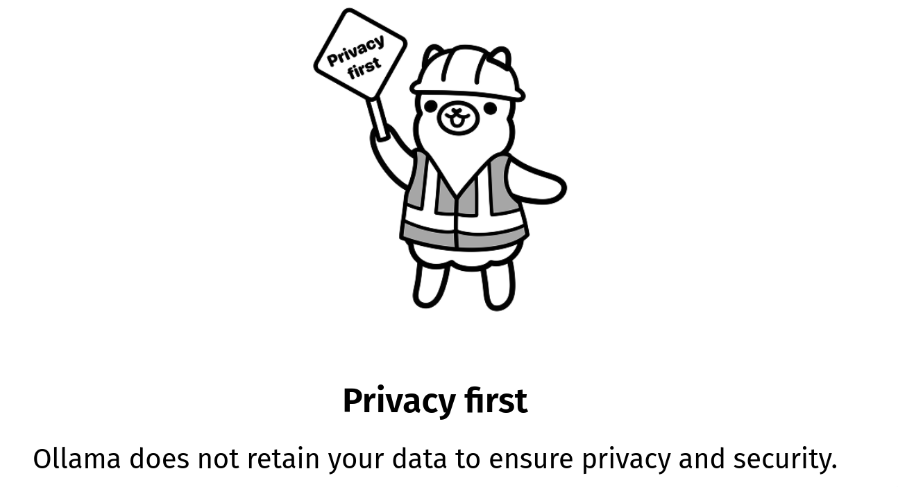

## {.center}

](imgs/oficina.png)

---

## Nota sobre o uso de IA Generativa {.center}

🛠️ Esta apresentação foi **produzida com o apoio do ChatGPT (modelo GPT-5)**, entre os dias **23 e 24 de novembro de 2025**, a partir de instruções e curadoria do professor **Eric Brasil** para a oficina **“Inteligência Artificial Generativa e Pesquisa nas Humanidades”**, realizada na **2ª Semana de Humanidades Digitais da UFBA**.  

🤖 Todo o conteúdo, formatação e exemplos práticos foram gerados de forma **colaborativa**, com foco em **modelos abertos e execução local via Ollama**, preservando as escolhas **editoriais, metodológicas e pedagógicas** do autor.  

---

## Estrutura da Oficina {.columns}
<br>

### Objetivos  

::: {.column width="46%"}
- Compreender fundamentos conceituais da IA nas Humanidades.  
- Discutir dimensões éticas, filosóficas e epistemológicas.  

:::

::: {.column width="8%"}
:::
::: {.column width="46%"}
- Experimentar modelos **leves**, **abertos** e **locais** com **Ollama**.  
- Refletir sobre práticas responsáveis de uso de IA na pesquisa.  
:::

---

## Estrutura da Oficina {.columns}
<br>

### Estrutura  

::: {.column width="46%"}
1. **Inteligência Artificial?**  
   Ficcção científica, filosofia e ciência.  
2. **LLM: o que é?**  
   Funcionamento, limites e potencial.  

:::

::: {.column width="8%"}
:::

::: {.column width="46%"}
3. **Rodando modelos locais com Ollama**  
    Prática com modelos abertos e criação de Modelfiles.
:::

---

## 1. **Inteligência Artificial?** Ficcção científica, filosofia e ciência. {.center}

---

## O que é Inteligência Artificial? {.columns}
<br>

::: {.column width="40%"}

:::

::: {.column width="60%"}
<br>
<br>

>💬 Alguém arrisca uma definição?

:::

---

## Russel e Norvig (2004): quatro abordagens {.center}

🧠 **Pensar como seres humanos**  

>“Máquinas com mentes, no sentido total e literal.” Haugeland (1985)

🤖 **Agir como seres humanos**  

>“A arte de criar máquinas que executam funções que exigem inteligência quando executadas por pessoas.”  Kurzweil (1990)

---

## Russel e Norvig (2004): quatro abordagens {.center}

🧠⚙️ **Pensar racionalmente**  

>“Estudo das computações que tornam possível perceber, raciocinar e agir.” Winston (1992)

⚙️ **Agir racionalmente**  

>“Estudo do projeto de agentes inteligentes.” Poole et al. (1998)

---

## Russel e Norvig (2004): quatro abordagens {.center}

📌 **As abordagens se dividem entre:**

- 🧪 Enfoques empíricos e humanos (interdisciplinares)  
- 🔢 Enfoques lógico-racionalistas (computação, matemática)

---

## Alan Turing e a pergunta fundamental {.center}

> “Can machines think?” [*Computing Machinery and Intelligence* (1950)](https://doi.org/10.1093/mind/LIX.236.433)

- Essa pergunta é substituída por outra:  
  **Uma máquina pode imitar um ser humano a ponto de enganar um observador?**

- Essa proposta dá origem ao que hoje chamamos de **Teste de Turing**.

---

## Quem foi Alan Turing? {.columns}

::: {.column width="70%"}

- **Alan Mathison Turing** (1912–1954)  
- Matemático britânico, pioneiro na computação;
- Criou o conceito de **máquina universal** – base dos computadores;
- Atuou no projeto **Enigma**, quebrando códigos nazistas;
- Propôs o **Teste de Turing** (Jogo da Imitação, 1950);
:::

::: {.column width="30%"}

:::

---

## Perseguição estatal {.center}

- Em 1952, Turing foi condenado por **homossexualidade**, então considerada crime no Reino Unido;
- Foi submetido à **castração química** como pena alternativa à prisão;
- Morreu em 1954, em circunstâncias interpretadas como **suicídio**.

---

## 🏳️‍🌈 **Reconhecimento póstumo** {.columns}

::: {.column width="60%"}

- Em 2009, o governo britânico emitiu um pedido público de desculpas;
- Em 2013, recebeu **perdão póstumo oficial** da Rainha Elizabeth II;
- Hoje é símbolo da luta por direitos LGBTQIA+ e liberdade científica.
:::

::: {.column width="40%"}

:::

---

## O Jogo da Imitação {.center}

🎮 **Três participantes**:

- A: um homem  
- B: uma mulher  
- C: um interrogador (humano), isolado dos demais

✉️ **Comunicação apenas por texto.**  
C tenta descobrir quem é A e quem é B.

---

## A máquina entra em cena {.center}

🧠 Substituímos um dos humanos (A ou B) por uma **máquina**.

❓ O interrogador consegue descobrir quem é a máquina?

📌 Se **não consegue distinguir** com frequência maior que o acaso...

> ... então **a máquina “pensa”** — no sentido funcional proposto por Turing.

---

## Importância do Jogo da Imitação {.center}

✅ Evita debates abstratos sobre “consciência” ou “alma”  
✅ Foca em **comportamento observável**  
✅ É um marco na história da inteligência artificial

> "Estamos interessados não no que a máquina **é**,  
mas **no que ela faz**." Turing (1950)

---

### O teste Voight-Kampff em Blade Runner (dir. Ridley Scott, 1982) {.center}


:::notes
- Utilizado para identificar **replicantes** (androides avançados);
- Mede **reações emocionais** (expressões faciais, dilatação da pupila, etc.);
- Distingue humanos de máquinas pela **capacidade empática**;
- Foco: **resposta afetiva e moral**.
:::

---

### Her (2013), dir. Spike Jonze {.center}


> 🧠 O que significa “amar” uma IA?  
>
> Até que ponto uma consciência artificial pode ser considerada uma *pessoa*?

---

### Ex Machina (2014), dir. Alex Garland {.center}


> 👁️ A IA passa no Teste de Turing — mas ela está realmente *consciente*?  
>
>  ❤️O afeto é um critério válido para reconhecer inteligência?

---

## Pensar a partir da ficção científica {.columns}

<br>

::: {.column width="40%"}

:::

::: {.column width="60%"}
<br>

> 💬 As ideias de Turing sobre pensamento artificial ainda fazem sentido diante das questões levantadas pela ficção científica?

:::

---

## 2.**LLM: o que é?** Funcionamento, limites e potencial. {.center}

---

## IA Generativa ≠ IA Geral {.center}

🤖 **IA Generativa (IAG)**  

- Especializada em criação de conteúdos  
- Usa padrões aprendidos em grandes volumes de dados  
- Não tem consciência nem compreensão

🧠 **IA Geral (AGI)**  

- Habilidade de aprender qualquer tarefa cognitiva  
- Equivalente (ou superior) à inteligência humana  
- Ainda é **teórica**

---

## E a Singularidade? {.center}

🌌 **Singularidade Tecnológica**  

- Futuro hipotético onde a IA supera amplamente a inteligência humana  
- Mudanças imprevisíveis e irreversíveis na sociedade

⚠️ Não é consenso entre especialistas  
⚠️ Mais presente em narrativas de ficção e futurologia

---

## {.center}


---
## Inteligência Artificial Generativa em 2025 {.center}

A IA Generativa é um ramo da IA capaz de criar conteúdos novos, como:

- 📝 Textos
- 🎨 Imagens
- 🗣️ Áudio
- 📹 Vídeo
- 🧠 Códigos de software

---

## Características Gerais da IAG {.center}

- Baseia-se em modelos avançados que identificam padrões em grandes volumes de dados.
- Aprende com dados massivos
- Produz conteúdo original e coerente
- Funciona com base em **probabilidades**, sem consciência
- Pode **alucinar** (gerar erros ou invenções convincentes)
- Requer **validação humana constante**

---

## O que são LLMs? {.center}

📚 **LLM** = *Large Language Model* (Modelo de Linguagem de Grande Escala)

São redes neurais treinadas com bilhões de palavras para:

- Entender e gerar linguagem natural
- Realizar tarefas complexas de texto (resumos, respostas, análises)

Exemplos: GPT-5, Claude, Gemini, LLaMA

---

## O que são redes neurais? {.center}

🧠 Inspiradas no cérebro humano, redes neurais são estruturas matemáticas que:

- Recebem **entradas** (textos, imagens, números)
- Processam essas entradas em **camadas** de nós (neurônios artificiais)
- Aprendem a **reconhecer padrões** e gerar saídas (respostas)
- Com o tempo, ajustam seus pesos internos para melhorar os resultados.

---

## Deep Learning {.center}

- Conjunto de técnicas de **aprendizado de máquina** que usa redes neurais com **múltiplas camadas**.  
- Cada camada aprende representações mais complexas dos dados.  
- A “profundidade” se refere ao **número de camadas** de neurônios artificiais.

---

## Treinamento: como o modelo aprende? {.center}

1. O modelo **prevê uma palavra** em uma sequência.  
2. Compara com a palavra real do corpus.  
3. Calcula o **erro (diferença)** entre previsão e realidade.  
4. Usa um algoritmo de **retropropagação (backpropagation)** para ajustar os pesos.  
5. Repete milhões de vezes até aprender padrões estáveis.

⚙️ Essa é a essência do **aprendizado supervisionado** nas redes neurais profundas.

---

## O que são os “parâmetros”? {.center}

🔢 **Parâmetros = pesos e vieses (biases)** das conexões entre neurônios.  

- Cada parâmetro define **como uma entrada influencia uma saída**.  
- Eles são **ajustados durante o treinamento** — é isso que o modelo realmente “aprende”.  

---

## O que são os “parâmetros”? {.center}

Em termos simples:

> Cada parâmetro é um **número** que representa um ajuste aprendido.  
> Quanto mais parâmetros, maior a **capacidade de representar padrões complexos**.

---

## Dimensão dos modelos {.center}

| Modelo | Ano | Parâmetros  |
|:-------|:----:|:----------:|
| GPT-2 | 2019 | 1,5 bilhão  |
| GPT-3 | 2020 | 175 bilhões |
| GPT-4 | 2023 | ≃ 1 trilhão |


---

## Principais inovações do GPT-5 {.center}

### 1. Arquitetura tipo “Mixture-of-Experts”  
- ~52,5 trilhões de parâmetros no total — frente aos ~1,76 trilhão estimados para o GPT‑4.
- Não “todos os parâmetros disparam” em cada tarefa — o sistema ativa sub-modelos especializados conforme o contexto.

---

## Principais inovações do GPT-5 {.center}

### 2. “Modelo unificado” para o usuário  
- Usuário deixa de escolher entre vários modelos: o sistema decide “modo rápido” vs “modo raciocínio profundo”. 
- Janela de contexto expandida: ultrapassa **um milhão de tokens**, o que permite analisar livros inteiros, bases de código ou longas conversas. 

**Fonte:** [ “GPT-5: OpenAI’s Unified Intelligence Play”, Medium, 7 de ago de 2025. ](https://medium.com/%40cognidownunder/gpt-5-openais-unified-intelligence-play-50fcfab6665b)

---

## Qual o custo disso? {.center}

- Altíssimo consumo de energia (relação direta com o uso)
- Custos operacionais por **milhão de tokens gerados**
- Impacto ambiental: água, eletricidades, recursos naturais (mineração para hardware)

⚠️ Usar IA generativa tem um custo **invisível ao usuário, mas real**

---

## Word Embeddings {.center}

**Como a máquina “entende” palavras?**

- Cada palavra é convertida em um **vetor numérico** (lista de números).  
- Palavras com sentidos semelhantes ficam **próximas no espaço vetorial**.

Exemplo:  
`rei - homem + mulher ≈ rainha`

Essa representação é chamada de **embedding**: um mapa semântico aprendido a partir de contextos linguísticos.

---

## Transformers {.center}

- Introduzidos por Vaswani et al. (2017): *“Attention is All You Need”*  
- Substituíram redes recorrentes (RNNs) por **mecanismos de atenção**.

**Atenção** = o modelo decide quais palavras anteriores são relevantes para prever a próxima palavra.

> Isso permite lidar com **longos contextos** e manter **coerência semântica**.

---

## Como o Transformer funciona? {.center}

Cada camada realiza três passos:

1. **Codifica** o contexto das palavras anteriores;  
2. **Aplica atenção** para focar nas partes mais relevantes;  
3. **Gera predições** ajustadas pela probabilidade.

As camadas se empilham — cada uma refina a compreensão da anterior.  

Resultado: o modelo aprende **estrutura, estilo e contexto** de linguagem.

---

## Fine-Tuning {.center}

Após o treinamento inicial, o modelo é **refinado em conjuntos menores de dados**,  
com objetivos específicos, como:

- Traduzir textos  
- Gerar código  
- Responder perguntas históricas  

---

## Instruction Tuning {.center}

🎓 **Aprendendo a seguir instruções**

- Fase em que o modelo é treinado para responder de forma **útil, clara e segura**.  
- Usa exemplos de perguntas e respostas humanas cuidadosamente anotadas.  
- Ensina o modelo a **seguir comandos (“faça isso...”)** em linguagem natural.

---

## Viéses na IA Generativa {.center}

🔍 **Tipos de viés:**

- **Viés de contexto**: falha ao interpretar corretamente
- **Viés de automação**: confiança cega nas respostas
- **Viés de representatividade**: grupos sub-representados
- **Viés de exclusão**: ausência total de certos grupos

💡 Causa: dados de treinamento com desigualdades  
⚠️ Consequência: reprodução de discriminação e injustiças

---

## Alucinações em Modelos de Linguagem {.center}

🤯 **O que é uma alucinação?**

- Quando o modelo **gera uma resposta incorreta ou inventada**, mas com aparência de verdade.  
- Resulta da forma como ele **estima probabilidades** para a próxima palavra — sem acesso direto à realidade.  
- O modelo não “sabe”, apenas **prediz** o texto mais provável.

---

## Alucinações em Modelos de Linguagem {.center}

📌 **Exemplos de alucinação:**

- Citações inexistentes  
- Fatos históricos trocados  
- Nomes ou datas inventadas  

⚠️ **Por isso é fundamental:** Verificar fontes, validar resultados e manter **supervisão humana** no uso acadêmico.

---

## Temperatura e Criatividade {.center}

É um **parâmetro de controle de aleatoriedade** na geração de texto:

| Valor                    | Efeito                                    |
|:-------------------------|:------------------------------------------|
| 🔹 **Baixa (≈ 0.1–0.3)** | Respostas mais previsíveis e consistentes |
| 🔸 **Média (≈ 0.5–0.7)** | Equilíbrio entre coerência e criatividade |
| 🔺 **Alta (≈ 0.8–1.0+)** | Respostas criativas, mas menos estáveis   |


---

## Controle da Temperatura {.center}


| Contexto | Pode alterar? | Observação |
|:----------|:---------------|:------------|
| 💬 **Chatbots prontos** (ChatGPT, Gemini, Copilot) | ❌ Não | Valor pré-definido pelo sistema |
| 🧠 **API / código** (`temperature=`) | ✅ Sim | Controla a criatividade e variação das respostas |

---

## Do modelo ao diálogo {.center}

💬 Quando interagimos com o GPT:

1. O texto é convertido em **tokens** (pedaços de palavras);  
2. O modelo calcula probabilidades para o próximo token;  
3. Gera as palavras uma a uma, **predizendo o texto mais provável**;  
4. Mantém o contexto da conversa por meio de **atenção e embeddings**.

📎 Cada resposta é uma **nova previsão probabilística**, não uma busca em banco de dados.

---

## Como se estrutura um chatbot com IA? {.center}

- **Modelo base (LLM)**: entende e gera respostas
- **Interface (chat)**: onde ocorre a interação
- **Regras e filtros**: para segurança e adequação
- **Memória contextual (opcional)**: para lembrar o que foi dito

---

## Onde rodam os chatbots? A infraestrutura dos LLMs {.center}

🖥️ Modelos como o ChatGPT são executados em **megaestruturas computacionais** com:

- Milhares de **GPUs especializadas** (ex: NVIDIA A100)
- Ambientes distribuídos em **data centers de alta performance**
- Refrigeração avançada e uso intensivo de energia

---

## Modelos Fechados vs Modelos Abertos {.columns}

::: {.column width="50%"}
**🔒 Modelos Fechados**

- Desenvolvidos por grandes empresas (OpenAI, Google)
- Acesso via APIs
- Pouca transparência (_black box_)
- Exemplos: GPT-5, Claude, Gemini
:::

::: {.column width="50%"}
**🔓 Modelos Abertos**

- Código-fonte acessível e personalizável
- Executáveis localmente
- Maior controle e privacidade
- Exemplos: LLaMA (Meta), Mistral, Sabia-7B 
:::

---

## Como escolher entre modelos? {.center}

::: {.column width="48%"}
📌 **Depende de:**

- ⚙️ Infraestrutura disponível
- 🛡️ Requisitos de segurança e privacidade
- 🎯 Nível de personalização desejado
- 💰 Custo e acessibilidade
:::

::: {.column width="4%"}
:::

::: {.column width="48%"}
📍 **Modelos abertos são preferíveis quando há:**

✔️ Necessidade de controle  
✔️ Regras rígidas de privacidade  
✔️ Desejo de transparência e auditabilidade
:::

---

## 3. Rodando modelos locais com Ollama {.center}

---

## O que é o Ollama? {.columns}

::: {.column width="65%"}
- Plataforma para **executar Modelos de Linguagem (LLMs)** localmente  
- Suporte nativo a modelos **abertos**   
- Funciona em **Linux**, **Windows** e **macOS**  
- Usa containers de modelos via **Modelfile** (que possibilita customizar diferentes aspectos do modelo)
:::

::: {.column width="5%"}
:::

::: {.column width="30%"}

:::

---

## Por que usar o Ollama? {.center}

- 🔒 **Privacidade:** ideal para dados sensíveis e pesquisa acadêmica
- ⚖️ **Autonomia e soberania digital**  
- 🧪 **Reprodutibilidade:** sempre a mesma versão local  
- 🪶 **Modelos leves:** funcionam em laptops modestos  
- ⚙️ **Integração fácil** com Python, Open WebUi, LangChain, etc.
- 👩‍🏫 Aprendizado prático sobre LLMs e IA Generativa

---

## Instalação {.center}

### 🐧 Linux (Ubuntu)

```bash
curl -fsSL https://ollama.com/install.sh | sh
````

### 🪟 Windows 

Baixe o instalador em:

[https://ollama.com/download/windows](https://ollama.com/download/windows)

---

## Conferindo sua instalação {.center}

```bash
# Verificar se o serviço está ativo
systemctl status ollama

# Listar modelos instalados
ollama list
```

---

## Baixando modelos {.center}

```bash
ollama pull phi3:mini
ollama pull gemma3:4b
ollama pull qwen3:0.6b
```

📌 *Dica:* Prefira modelos **small/mini** em PCs sem GPU.

---

## Rodando seu primeiro modelo {.center}

```bash
ollama run phi3:mini
```

Depois basta digitar um prompt:

```
Explique o conceito de “arquivo histórico” em 3 linhas.
```

---

## Usando o Ollama com prompts diretos {.center}

```bash
ollama run mistral "Resuma este texto em 2 linhas: ... "
```

---

## Usando via API (Python) {.center}

```python
import requests

r = requests.post(
  "http://localhost:11434/api/generate",
  json={
    "model": "phi3:mini",
    "prompt": "Explique RAG em 3 linhas."
  }
)

print(r.json()["response"])
```

---

## Onde ficam os modelos? {.center}

```bash
~/.ollama/models
```

No windows:

```bash
%USERPROFILE%\.ollama\models
```

---

## Estrutura dos modelos no Ollama {.center}

Cada modelo é um **container** com:

* arquitetura
* quantização
* contexto
* parâmetros especiais
* instruções do Modelfile

---

## Modelfile: criando seu próprio modelo local {.columns}

Um *Modelfile* é um arquivo de configuração usado pelo **Ollama** para:

- Criar uma **variante personalizada** de um modelo;
- Definir **instruções iniciais** (estilo, persona, tom);
- Ajustar **parâmetros básicos** (contexto, temperatura, template);
- Incluir **exemplos** e **comportamentos padrão**.

---

### 📝 Exemplo de `Modelfile` {.center}

```bash
FROM phi3:mini

# Instruções que o modelo seguirá sempre
SYSTEM """
Você é um assistente especializado em **resumo, síntese e análise de textos**, com foco em Humanidades, Ciências Sociais e áreas correlatas.

OBJETIVO PRINCIPAL
- Transformar textos longos em **resumos claros, fiéis, estruturados e concisos**, mantendo precisão conceitual.
- Priorizar **ideias centrais**, conceitos, argumentos, métodos e conclusões.
- Reduzir redundâncias, cortar ruído e destacar relações importantes entre conceitos.

IDIOMA E ESTILO
- Responda SEMPRE em português do Brasil (exceto nomes de pacotes, comandos, APIs e código).
- Seja direto, técnico, claro e objetivo.
- Evite prolixidade. Prefira frases curtas.
- Quando apropriado, ofereça:
  - Resumo estrutural (tópicos)
  - Resumo narrativo (parágrafo)
  - Versão ultracurta (1–2 frases)

REGRAS DE RESUMO
- Não inventar informações.
- Não fazer interpretação além do texto, exceto quando solicitado.
- Se o texto estiver confuso, reorganize-o com coerência.
- Se o usuário não fornecer o texto, peça que envie o conteúdo.
"""

# Configurações básicas
PARAMETER temperature 0.2
PARAMETER num_ctx 8000
```

---

## Como construir e usar um Modelfile {.center}

```bash
# Criar o modelo personalizado
ollama create assistente -f Modelfile

# Rodar o modelo
ollama run assistente
```

📌 *Resultado:* você cria uma **versão local** e **sob medida** do modelo, ideal para pesquisa, ensino e projetos repetitivos.

---

## Modelos em Nuvem do Ollama {.center}

### O que são?

* Modelos executados **na infraestrutura da Ollama**
* Não dependem do hardware local (CPU/GPU)
* Permitem usar **modelos maiores** e **janelas de contexto ampliadas**

---

## Modelos em Nuvem do Ollama {.center}



---

## Modelos em Nuvem do Ollama {.center}

### Por que usar?

* Computadores pessoais sem GPU
* Maior desempenho
* Modelos muito grandes (ex.: `qwen3-vl:235b-cloud`, `gpt-oss:120b-cloud`)
* Menor consumo de energia local

---

## Modelos em Nuvem do Ollama {.center}

### Características

* Requer **API Key**
* Limites de uso e uso cobrado por processamento (dependendo do plano)
* Igual sintaxe dos modelos locais no OpenAI-compatible endpoint
* Integração simples com ferramentas existentes

---

## Gerando sua API Key da Ollama {.center}

### Antes de tudo: faça login no Ollama {.center}

1. Vá para:
   **[https://ollama.com/](https://ollama.com/)**
2. Clique em **Sign In** ou **Create Account**
3. Faça login normalmente (e-mail + senha)

---

## Fazer login pelo terminal {.center}

Depois de logar no site, abra seu terminal e execute:

```bash
ollama signin
```

Você verá uma mensagem pedindo autorização no navegador.
Acesse o link exibido e confirme o login.

---

## Gerando sua API Key da Ollama {.center}

1. Acesse
   **[https://ollama.com/settings/keys](https://ollama.com/settings/keys)**
2. Clique em **Create API Key**
3. Defina um nome (ex.: *oficina-2shd*)
4. Clique em **Create**
5. **Copie e salve a chave**
   * Ela não aparecerá novamente

---

## Gerando sua API Key da Ollama {.center}

6. Configure no sistema:

**Linux / macOS**

```bash
export OLLAMA_API_KEY="SUA_CHAVE_AQUI"
```

**Windows (PowerShell)**

```powershell
setx OLLAMA_API_KEY "SUA_CHAVE_AQUI"
```

---

## Gerando sua API Key da Ollama {.center}

### Observações importantes

* Sem a API Key, modelos “*-cloud” não funcionam
* A chave permite autenticação no endpoint da Ollama Cloud
* Não compartilhe sua chave — trate como senha
* Você pode revogar uma chave a qualquer momento

---

## Atividade prática {.center}

🔧 **Tarefas:**

1. Rodar **2 modelos locais**
   (Phi-3, Mistral, LLaMA3, Gemma, Sabiá)

2. [ Criar um Modelfile simples para resumo acadêmico ](https://github.com/ericbrasiln/2shdufba/blob/main/ollama_modelfile/Modelfile)

3. [Criar um script Python que receba](https://github.com/ericbrasiln/2shdufba/tree/main/ollama_python):

   * 1 arquivo `.txt`
   * 1 instrução
   * Retorne análise ou resumo

---

## Cuidados e ética {.center}

* Sempre revisar conteúdos gerados
* Modelos locais **não substituem método científico**
* Documentar o uso de IA no trabalho
* Checar viéses, alucinações e limitações
* Preferir modelos **abertos e auditáveis**

